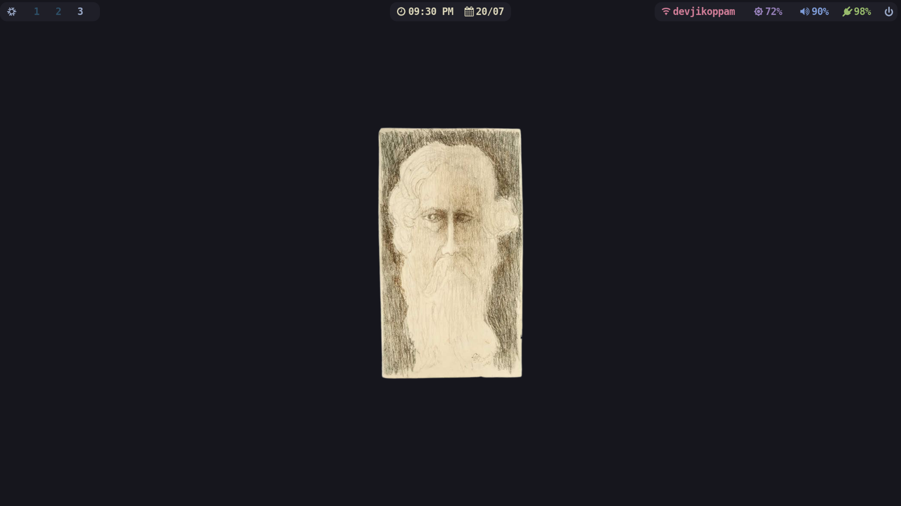

# V4zha's DotFiles

This repository contains my personal dotfiles and configuration files of my NixOS system.The setup includes Hyprland as window manager and Waybar as the status bar, along with Rofi-Wayland as the application launcher.

## Installation

To replicate this configuration on your NixOS system:

1. Make sure you have Nix installed on your system.
2. Clone this repository to your preferred location:

```bash
git clone https://github.com/v4zha/dotfiles.git
cd dotfiles
```

3. Adjust the configuration files according to your preferences.
4. Use Home-Manager to activate the dotfiles:

```bash
sudo nixos-rebuild switch --flake ./#v4zha-nix
home-manager switch --flake ./#v4zha
```

Feel free to explore, modify, and adapt these dotfiles to suit your needs. : )
